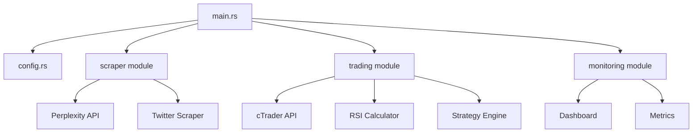

# 🌴 Palm Oil Trading Bot

[](https://www.rust-lang.org/)
[](LICENSE)
[](#testing)

Automated trading bot for **FCPO (Crude Palm Oil Futures)** CFDs on Fusion Markets via cTrader Open API.

**Objective**: 2-3% daily returns through scalping strategy combining technical analysis (RSI) and real-time sentiment analysis.

**Status**: 🟡 Development Phase (Demo Account Only)

---

## 📋 Table of Contents

- [Features](#features)
- [Trading Strategy](#trading-strategy)
- [Architecture](#architecture)
- [Installation](#installation)
- [Configuration](#configuration)
- [Usage](#usage)
- [Testing](#testing)
- [Deployment](#deployment)
- [Risk Warning](#risk-warning)

---

## ✨ Features

### ✅ Implemented

- **cTrader Open API client** (TCP + Protobuf) with auth flow and message handling
- **Dual-signal strategy engine** combining RSI and sentiment for buy/sell decisions
- **Technical indicators**: RSI, EMA, MACD, Bollinger Bands, ATR
- **Order & position management**: position lifecycle, P&L, trailing stops, TP/SL handling
- **Risk controls**: Circuit breakers (daily loss -5%, consecutive losses, volatility spikes), max positions, risk-based sizing, cooldowns after losses
- **Advanced features**: Event system (MPSC channels), candle aggregation (M1/M5/M15/H1), real-time market data pipeline
- **Sentiment analysis**: Perplexity API client + Twitter parsing fallback with score normalization
- **Monitoring & analytics**: CLI dashboard, trade metrics, risk metrics (win rate, drawdown, Sharpe/Sortino, VaR)
- **Backtesting binary** for strategy validation on synthetic/historical data
- **Config & secrets management** via `.env` with schema validation
- **Containerization & deployment**: Dockerfile + Railway/Fly.io configs

---

## 🎯 Trading Strategy

### Entry Signals

| Condition | Signal | Rationale |
|-----------|--------|-----------|
| RSI < 30 **AND** Sentiment > +30 | **BUY** | Oversold + Bullish news = Reversal opportunity |
| RSI > 70 **AND** Sentiment < -30 | **SELL** | Overbought + Bearish news = Correction expected |

### Exit Conditions

| Trigger | Action | Parameters |
|---------|--------|------------|
| Take Profit | Close position | +2.0% P&L (configurable) |
| Stop Loss | Close position | -1.5% P&L (configurable) |
| Circuit Breaker | Stop all trading | -5.0% daily loss |
| Max Positions | Block new entries | 1 concurrent position |

### Risk Management Rules

1. **Position Sizing**: 1% risk per trade (adjustable)
2. **Consecutive Loss Protection**: 3 losses → 15min cooldown
3. **Daily Reset**: Counters reset at midnight UTC
4. **Forced Exits**: All positions closed if circuit breaker triggers

---

## 🏗️ Architecture

### Project Structure

```
palm-oil-bot/
├── src/
│   ├── main.rs                    # Entry point + orchestration loop
│   ├── lib.rs                     # Library exports
│   ├── config.rs                  # Environment configuration loader
│   ├── error.rs                   # Custom error types (BotError, CTraderError)
│   │
│   ├── modules/
│   │   ├── scraper/               # 📰 Sentiment Analysis Module
│   │   │   ├── perplexity.rs      # Perplexity API client (sonar model)
│   │   │   ├── twitter.rs         # Twitter KOL scraping (backup)
│   │   │   └── sentiment.rs       # Sentiment scoring (-100 to +100)
│   │   │
│   │   ├── trading/               # 📈 Trading Logic Module
│   │   │   ├── ctrader.rs         # cTrader Protobuf TCP client
│   │   │   ├── protobuf.rs        # Protobuf message definitions
│   │   │   ├── indicators.rs      # RSI calculator (14-period)
│   │   │   ├── strategy.rs        # Trading strategy engine
│   │   │   └── orders.rs          # Position & order management
│   │   │
│   │   ├── monitoring/            # 📊 Monitoring Module
│   │   │   ├── dashboard.rs       # ratatui CLI dashboard
│   │   │   └── metrics.rs         # Performance metrics tracker
│   │   │
│   │   └── utils/                 # 🔧 Utilities
│   │       └── helpers.rs         # Helper functions
│   │
│   └── bin/
│       ├── test_connection.rs     # cTrader connection tester
│       └── backtest.rs            # Strategy backtesting engine
│
├── tests/
│   └── integration_test.rs        # Integration tests (9 tests)
│
├── proto/
│   └── ctrader.proto              # cTrader Protobuf definitions
│
├── Cargo.toml                     # Dependencies & binaries
├── Dockerfile                     # Production container
├── railway.toml                   # Railway deployment config
├── .env.example                   # Example environment variables
└── README.md                      # You are here
```

### Module Dependencies



### Technology Stack

| Component | Technology | Purpose |
|-----------|-----------|---------|
| **Language** | Rust 1.75+ | High-performance, memory-safe |
| **Async Runtime** | Tokio | Concurrent I/O operations |
| **HTTP Client** | Reqwest | Perplexity API calls |
| **Protobuf** | Prost | cTrader API communication |
| **Dashboard** | Ratatui + Crossterm | Terminal UI |
| **Serialization** | Serde | JSON/Config parsing |
| **Logging** | Tracing | Structured logging |

---

## 🚀 Installation

### Prerequisites

- **Rust**: 1.75 or higher ([Install Rust](https://rustup.rs/))
- **cTrader Account**: Demo account on Fusion Markets ([Register](https://www.fusionmarkets.com/))
- **Perplexity API**: API key ([Get API Key](https://www.perplexity.ai/))
- **Protobuf Compiler** (optional): `protoc` for rebuilding proto files

### Step 1: Clone Repository

```bash
git clone https://github.com/yourusername/palm-oil-bot.git
cd palm-oil-bot
```

### Step 2: Setup Environment

```bash
# Copy example environment file
cp .env.example .env

# Edit with your credentials
nano .env
```

**Required variables:**
- `CTRADER_CLIENT_ID`: Your cTrader Open API client ID
- `CTRADER_CLIENT_SECRET`: Your cTrader Open API client secret
- `CTRADER_ACCOUNT_ID`: Your demo account ID
- `PERPLEXITY_API_KEY`: Your Perplexity API key

### Step 3: Build

```bash
# Development build
cargo build

# Release build (optimized)
cargo build --release
```

### Step 4: Verify Installation

```bash
# Test cTrader connection
cargo run --bin test-connection

# Expected output:
# ✅ Connected to cTrader Demo Server
# ✅ Account authenticated: 10092792
```

---

## ⚙️ Configuration

### Environment Variables

Full configuration reference (see [.env.example](.env.example)):

#### cTrader API

```env
CTRADER_CLIENT_ID=20529_xxx           # OAuth client ID
CTRADER_CLIENT_SECRET=Uk4HHxxx        # OAuth client secret
CTRADER_ACCOUNT_ID=10092792           # Trading account ID
CTRADER_SERVER=demo.ctraderapi.com    # Server (demo or live)
CTRADER_PORT=5035                     # TCP port
```

#### Perplexity API

```env
PERPLEXITY_API_KEY=pplx-xxx           # API key from perplexity.ai
```

#### Trading Parameters

```env
SYMBOL=FCPO                           # Trading symbol (FCPO = Palm Oil)
RISK_PER_TRADE=1.0                    # Risk % per trade (1.0 = 1%)
TAKE_PROFIT_PERCENT=2.0               # TP threshold (+2%)
STOP_LOSS_PERCENT=1.5                 # SL threshold (-1.5%)
MAX_POSITIONS=1                       # Max concurrent positions
MAX_DAILY_LOSS_PERCENT=5.0            # Circuit breaker (-5%)
```

#### Strategy Parameters

```env
RSI_PERIOD=14                         # RSI calculation period
RSI_OVERSOLD=30                       # Oversold threshold
RSI_OVERBOUGHT=70                     # Overbought threshold
RSI_TIMEFRAME=5m                      # Candle timeframe (5 minutes)
SENTIMENT_THRESHOLD=30                # Min sentiment for signal (±30)
```

#### Bot Settings

```env
CYCLE_INTERVAL_SECS=60                # Main loop interval (60s)
DRY_RUN=true                          # Dry run mode (no real orders)
RUST_LOG=info                         # Log level (debug/info/warn/error)
```

---

## 📖 Usage

### Run the Bot

```bash
# Development mode (with logs)
RUST_LOG=info cargo run

# Release mode (optimized)
cargo run --release

# With custom config
cargo run -- --config custom.env
```

**Expected output:**

```
🌴 Palm Oil Trading Bot - Starting up...
✅ Configuration loaded from .env
✅ Connected to cTrader Demo Server
✅ Perplexity API client initialized
📊 Dashboard started (press 'q' to quit)

╔══════════════════════════════════════════════════════════╗
║         🌴 PALM OIL BOT - LIVE DASHBOARD 🌴              ║
╠══════════════════════════════════════════════════════════╣
║ Status          : 🟢 Running (DRY RUN)                   ║
║ Account         : 10092792 (DEMO)                        ║
║ Balance         : $10,000.00 (+0.00% today)              ║
╠══════════════════════════════════════════════════════════╣
║ MARKET DATA                                              ║
║ FCPO Price      : 4,832.50 MYR                          ║
║ RSI (5m)        : 42.3                                   ║
║ Sentiment       : +28 (Neutral)                         ║
╠══════════════════════════════════════════════════════════╣
║ OPEN POSITIONS                                           ║
║ No positions open                                        ║
╚══════════════════════════════════════════════════════════╝
```

### Backtesting

```bash
# Run backtest on synthetic data (1000 candles)
cargo run --bin backtest

# Expected output:
╔══════════════════════════════════════════════════════════╗
║          🌴 BACKTEST RESULTS - PALM OIL BOT 🌴           ║
╠══════════════════════════════════════════════════════════╣
║ Initial Balance    : $10000.00
║ Final Balance      : $10243.50
║ Total P&L          : $243.50 (2.43%)
║ Win Rate           : 62.5%
║ Profit Factor      : 1.85
╚══════════════════════════════════════════════════════════╝
```

### Connection Testing

```bash
# Test cTrader API connection
cargo run --bin test-connection

# Output shows:
# ✅ TCP connection established
# ✅ OAuth authentication successful
# ✅ Account authorized
# 📊 Available symbols: FCPO, GOLD, EUR/USD...
```

---

## 🧪 Testing

### Run All Tests

```bash
# Run all tests (unit + integration)
cargo test

# Run with output
cargo test -- --nocapture

# Run specific test
cargo test test_complete_buy_signal_workflow

# Run only integration tests
cargo test --test integration_test
```

### Test Coverage

| Module | Unit Tests | Integration Tests |
|--------|-----------|-------------------|
| `config.rs` | 5 | - |
| `indicators.rs` | 8 | 1 |
| `strategy.rs` | 25 | 3 |
| `orders.rs` | 10 | 2 |
| `metrics.rs` | 8 | 1 |
| `dashboard.rs` | 2 | - |
| `perplexity.rs` | 3 | - |
| `sentiment.rs` | 4 | 1 |
| **TOTAL** | **53** | **9** |

### Code Quality

```bash
# Run linter
cargo clippy

# Format code
cargo fmt

# Check for unused dependencies
cargo machete
```

---

## 🚢 Deployment

### Railway (Recommended)

1. **Install Railway CLI**
   ```bash
   npm install -g @railway/cli
   railway login
   ```

2. **Initialize Project**
   ```bash
   railway init
   railway link
   ```

3. **Set Environment Variables**
   ```bash
   railway variables set CTRADER_CLIENT_ID=xxx
   railway variables set CTRADER_CLIENT_SECRET=xxx
   railway variables set CTRADER_ACCOUNT_ID=xxx
   railway variables set PERPLEXITY_API_KEY=xxx
   railway variables set SYMBOL=FCPO
   railway variables set DRY_RUN=true
   # ... set all variables from .env.example
   ```

4. **Deploy**
   ```bash
   railway up
   
   # Check logs
   railway logs
   
   # Check status
   railway status
   ```

### Docker (Manual)

```bash
# Build image
docker build -t palm-oil-bot:latest .

# Run container
docker run -d \
  --name palm-oil-bot \
  --env-file .env \
  --restart unless-stopped \
  palm-oil-bot:latest

# View logs
docker logs -f palm-oil-bot

# Stop container
docker stop palm-oil-bot
```

### Fly.io

```bash
# Install flyctl
curl -L https://fly.io/install.sh | sh

# Launch app
fly launch

# Set secrets
fly secrets set CTRADER_CLIENT_ID=xxx
fly secrets set PERPLEXITY_API_KEY=xxx
# ... set all secrets

# Deploy
fly deploy

# Monitor
fly logs
```

---

## ⚠️ Risk Warning

**IMPORTANT: READ BEFORE USING**

This bot is provided **for educational purposes only**.

- ✅ **Always test on DEMO account first** - Never start with real money
- ⚠️ **Trading involves substantial risk** - You can lose your entire investment
- 📉 **Past performance ≠ Future results** - Backtests do not guarantee profits
- 🚫 **No warranty** - Software provided "AS IS" without any guarantees
- 💰 **Trade responsibly** - Never trade with money you can't afford to lose
- 🔒 **Keep credentials secure** - Never commit `.env` to version control

**The authors and contributors are not responsible for any financial losses incurred through the use of this software.**

By using this software, you acknowledge that:
1. You understand the risks of automated trading
2. You have tested thoroughly on demo accounts
3. You accept full responsibility for your trading decisions
4. You will not hold the authors liable for any losses

---

## 📄 License

MIT License - See [LICENSE](LICENSE) for details.

Copyright (c) 2026 Palm Oil Trading Team

---

## 🤝 Contributing

Contributions welcome! Please:

1. Fork the repository
2. Create a feature branch (`git checkout -b feature/amazing-feature`)
3. Commit changes (`git commit -m 'Add amazing feature'`)
4. Push to branch (`git push origin feature/amazing-feature`)
5. Open a Pull Request

**Code Standards:**
- Run `cargo fmt` before committing
- Run `cargo clippy` and fix warnings
- Add tests for new features
- Update documentation

---

## 📚 Resources

- [cTrader Open API Docs](https://help.ctrader.com/open-api/)
- [Perplexity API Docs](https://docs.perplexity.ai/)
- [RSI Indicator Explained](https://www.investopedia.com/terms/r/rsi.asp)
- [Rust Documentation](https://doc.rust-lang.org/)

---

## 📞 Support

- **Issues**: [GitHub Issues](https://github.com/yourusername/palm-oil-bot/issues)
- **Discussions**: [GitHub Discussions](https://github.com/yourusername/palm-oil-bot/discussions)
- **Documentation**: [Wiki](https://github.com/yourusername/palm-oil-bot/wiki)

---

<p align="center">
  <strong>Built with 🦀 Rust | Deployed on 🚂 Railway | Trading 🌴 Palm Oil</strong>
</p>

<p align="center">
  <sub>Made with ❤️ by the Palm Oil Trading Team</sub>
</p>
# cacaobot
